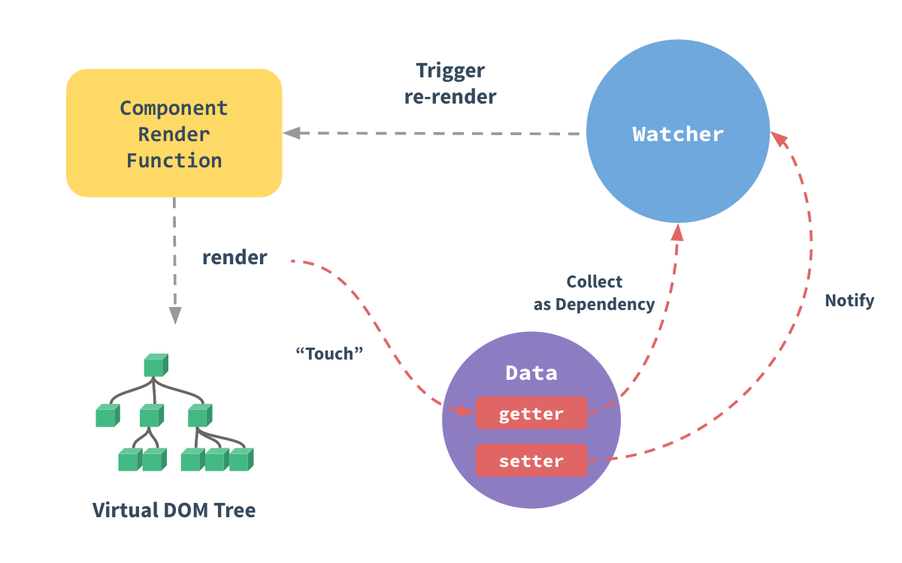

### Vue响应式原理

#### plainData 到 render的响应式变化
1. plainData -> 结构转换，添加_val, $get(): v, $set(v):void
 -> setters 插入回调，render -> auto re-render()
 

2. 使用 Proxy 代理 plainData，当触发 proxyInstance.set()时，触发render()

