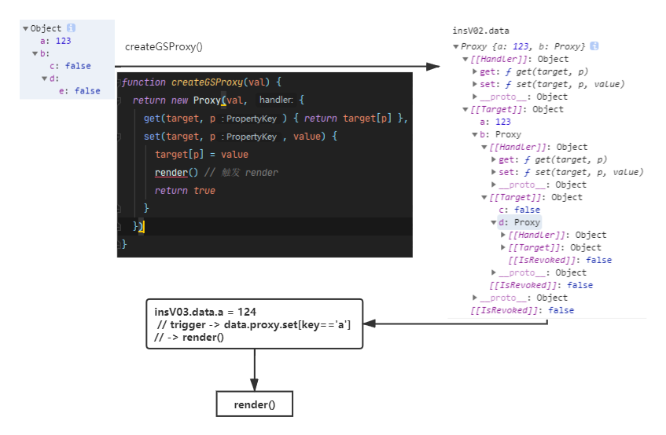
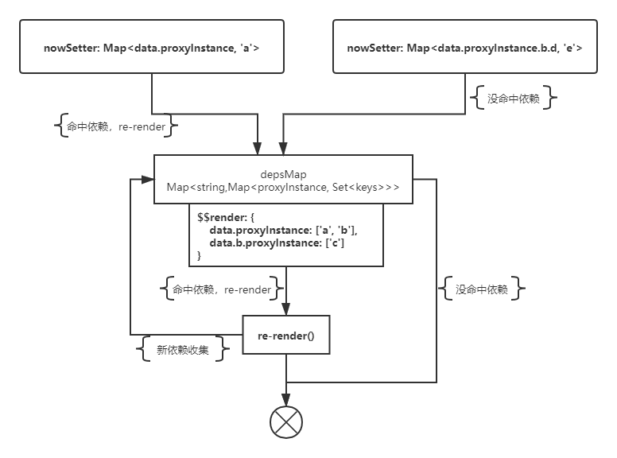
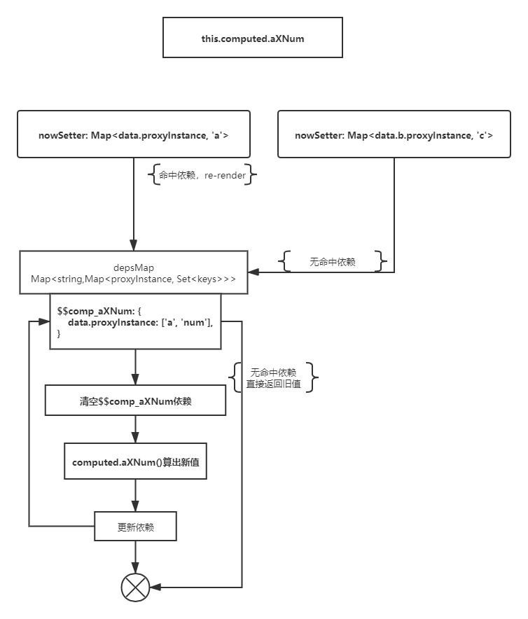

### Vue响应式原理


#### plainData 到 render的响应式变化
1. plainData -> 结构转换，添加_val, $get(): v, $set(v):void
 -> setters 插入回调，render -> auto re-render()
 

2. 使用 Proxy 代理 plainData，当触发 proxyInstance.set()时，触发render()


3. render 添加依赖收集，比对触发的setter是否对应依赖，判断是否执行 re-render

   ```flow
   st=>start: renderStart
   setHitDepsCond=>condition: 依赖Map是否命中setters
   clearDepOp=>operation: 清空render的依赖Map
   renderOp=>operation: 执行render函数&&收集deps
   setDepsOp=>operation: 设置新的render依赖Map
   end=>end
   
   st->setHitDepsCond
   setHitDepsCond(yes)->clearDepOp->renderOp->setDepsOp->end
   setHitDepsCond(false)->end
   ```

   

4. 添加 computed API

   
